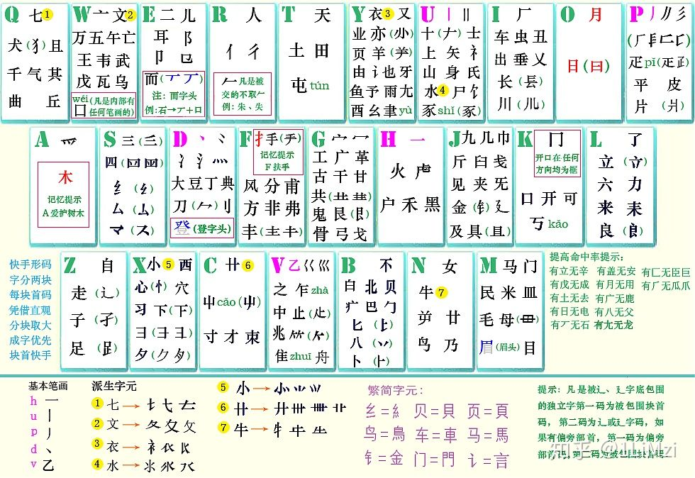

# Rime 输入法双拼加辅助码方案
<!-- # 这是一个 Rime 配置文件示例 -->
个人使用的 Rime 输入法配置，小鹤双拼+自然快手形码辅助方案，供参考。

## 方案说明
* 方案名称为“小鹤快手”，它提供了 小鹤双拼+自然快手双形辅助选字 的输入方案，使用 `[` 引出辅助码。
	* 如果希望使用 Tab 键也能引出辅助码，可以在 `flypy_zrmfast.schema.yaml` 文件里搜索找到 `tab引导辅助码`，取消该行的注释（将行首的 `#` 删除即可）。
	* 如果希望直接输入辅助码而不需要使用符号引导，可以在同样的文件里搜索找到 `直接引导辅助码`，取消该行的注释。
* 允许纯双拼输入。使用形码辅助造词之后，下次可以直接使用双拼部分输入这个词组。
* 例如，输入“输入”这个词组，“输”可以是 `uu`, `uu[i`, `uu[ir`，“入”可以是 `ru`, `ru[p`, `ru[pd`，敲 3x3 种输入码都可以得到“输入”一词。
	* 由于作者只找到了常用字的形码部分码表，有的生僻一些的字没有形码，只能敲其双拼部分来输入。
	* 双形辅助码根据简体字字形给出，即使在繁体输入模式下也是如此。
* 自然快手原作者给出的双形辅助码解读：

## 文件说明
* 将这些文件放入 Rime 的用户目录下，重新部署即可。
* `flypy_zrmfast.schema.yaml` 和 `flypy_zrmfast.dict.yaml` 为本方案的主要文件。其余文件均用于附加功能。
* `default.custom.yaml` 仅用于声明本方案的依赖方案。如果用户已经有同名的文件，并且其中设置了 `schema_list` 选项，可以直接将本项目同名文件的内容添加到该选项下，而不必使用项目提供的这一文件。
* `rime.lua` 文件用于涉及 Lua 的相关功能。如果用户已经有同名的文件，可以将本项目文件的内容复制添加到原有文件之中，但是可能需要自行确认其中的变量名、函数名与原有的那些没有冲突。
* 鉴于部分用户使用的 Rime 版本没有自带 emoji 输入方案，本项目提供了 `emoji.schema.yaml` 和 `emoji.dict.yaml` 文件。如果用户已经有这两个文件，可以不使用本项目提供的版本，不过不排除 emoji 输入时的输入法行为会有所不同。
* `easy_en.schema.yaml` 和 `easy_en.dict.yaml` 为作者基于 [easy-en](https://github.com/BlindingDark/rime-easy-en) 项目的英文输入方案修改得到的版本。如果用户已经有这两个文件，可以不使用本项目提供的版本，但英文单词输入的行为应该会有不同。

## 附加功能
<!-- * 小鹤快手方案、原版小鹤双拼都添加了如下这些奇怪的特性。如无特别说明，以下功能都是在对应的方案文件（`*.schema.yaml`，或 `*.schema.custom.yaml` 里）设置的。 -->
* 置顶字词与自定义词组：由 `custom_phrase.txt` 指定，用户可以根据自己的需要修改和添加。其中，自定义词组使用一些（小鹤双拼下）不对应汉字读音的字母组合作为词组开头，例如 `jf`。
* 鉴于使用辅助码之后很少需要翻页，通常只会用到候选的前几项，方案里设置了分号 `;` 用于输入次选，斜杠 `/` 用于输入第三选项。
* 鉴于双引号比单引号常用，方案里交换了这两个的位置。敲 `'` 输入的是 `“”`，而敲 `"` 输入的是 `‘’`。
	* 如果希望恢复默认的引号输入方式，可以在 `flypy_zrmfast.schema.yaml` 里搜索找到 `恢复默认引号`，共有两行，将它们都注释掉（在行首添加 `#` 符号），或者直接删掉也行。
* `as` 前缀：ASCII 模式，相当于临时切换到西文输入。例如：敲 `ashhh` 空格，即可输入“hhh”。
* 大写字母开头（即敲第一个键的时候按下 `Shift`）：也是 ASCII 模式。例如：敲 `Rime` 空格，即可输入“Rime”。
* `au` 前缀：大写模式，可以输入连续的几个大写字母，不需要大写锁定/`Shift` 键。例如：敲 `aulgpl` 空格，即可输入“LGPL”。
* `aw` 前缀：单词模式，不仅可以敲完整的单词，也允许“简写”，省略掉除了首字母以外的所有元音字母（`aeiou`）。例如：敲 `awelevation` 或者 `awelvtn` 再加空格，即可输入“elevation”。
	* 该功能基于 [easy-en](https://github.com/BlindingDark/rime-easy-en) 项目，简写特性由 `easy_en.schema.yaml` 文件中设置的拼写运算实现。作者对字典文件进行了精简处理以加快部署速度。如果用户希望使用更完整的字典文件，而同时保留简写特性，可以尝试将 `easy_en.dict.yaml` 文件更换为原项目的版本。
	* 使用的一个小 tips：单词第一次输入时用简写，Rime 会将它的词频记录进用户词典。之后的输入只需要敲完整单词的前半部分，它作为输入过的单词就会排在靠前的位置。
* `ae` 前缀：emoji 模式，注意这里需要按照英文输入。例如：敲 `aelaugh` 空格，即可输入“😂”。
* `ap` 前缀：临时全拼模式，用于一些长的词组。例如：敲 `aptlbchqzh` 空格，即可输入“螳螂捕蝉黄雀在后”。
* `ab` 前缀：笔画反查模式（Rime 默认的应该是用 `` ` `` 前缀），用笔画输入，且可以看到每个字的编码。例如：敲 `ab` 空格，即可输入“木”，并看到它的编码是 `mu[ub`。（不过如果只是想查编码的话，还是直接在字典文件里搜索更快。）
* `/` 前缀：符号模式，具体见 Rime 自带的 `symbols.yaml` 文件。例如：敲 `/jt` 按 3，即可输入“←”。
* `al` 前缀：简易 LaTeX 公式。例如：敲 `al<<f,ff>>ooc0` 空格，即可输入 `$\langle f,\phi\rangle\propto 0$`。
	* 这个功能需要 Lua 支持（下方有简单说明），功能的实现在 `rime.lua` 文件，可以在里面看具体的简写设定，以及试着自己修改（语法应该不难理解）。
	* 目前的简写由重复的字符触发，例如 `aa` 变成 `\alpha`。如果重复的字符是 `jvo` 中的一个，需要接上后面的一个字符触发，例如 `jj;` 变成 `\mapsto`。
	* 使用 `` ` `` 避免重复字符触发，例如敲 `,,bb` 得到 `\math\beta` 不是我们想要的，敲 ``,,b`b`` 则可以得到 `\mathbb`。
	* 如果 `` ` `` 两侧的字符不一样，则变成空格。例如，敲 ``\to`0`` 得到“`\to 0`”
	* 连续的两个 `` ` `` 始终按照一个空格处理。
* 敲 `afd` 可以输入当天的日期。需要 Lua 支持。
* 额外的 Emacs 键位
	* `Control+m` 可以替代回车。例如，敲 `yyds` 之后按这个键，输入的就是“yyds”。下方的 `as` 前缀是类似的功能。
	* `Control+w` 可以替代 `Control+退格`，为删一个字的码。例如，敲 `buk` 或者 `buke[dk` 之后，按这个键得到的都是 `bu`，可以继续敲后面的字。如果在词组输入时发现敲错了，可以用这个方式删掉最后的字。
	> Rime 自带的 Emacs 键位包括 `Control+[` 替代 `Esc`，取消当前输入；以及 `Control+h` 替代退格。另外，作者喜欢用 `Control` 键是因为在系统里配置了大写锁定和左 `Control` 交换，这样按起来很舒服。由于这是系统的配置而不是 Rime 的，本文件中没有说明其设置方式。

### 关于 Lua 支持
* 小狼毫（Windows）和鼠须管（MacOS）的最新版本应该都有 Lua 支持。
* Trime（Android）要在 [GitHub 页面](https://github.com/osfans/trime) 下载最新测试版（注意不是稳定版）。
* 中州韵（Linux）上的 Lua 支持作者自己也头疼，如果有哪位知道解决方案的可以告诉作者……
	* 据说 Arch Linux 源提供的 fcitx5-rime 可以在插件设置里开启 Lua 支持，由于发行版不同而放弃。
	* [有人编译的一个 ibus 版本的 AppImage](https://github.com/hchunhui/build) 能支持 Lua，但是在作者这里无法记录用户词组，遂弃用。
* irime（iOS）没用过，谁试了或许可以告诉作者（据说这个启用配置文件夹要花钱）。

## 推荐的文档
作者当时学习 Rime 的配置方案主要用的是这几个文档，推荐给各位：
[GitHub-UserGuide](https://github.com/rime/home/wiki/UserGuide#%E5%88%AA%E9%99%A4%E8%AA%A4%E4%B8%8A%E5%B1%8F%E7%9A%84%E9%8C%AF%E8%A9%9E)（访问 GitHub 不稳定的可以用 [Gitee 版本](https://gitee.com/lotem/rime-home/wikis/UserGuide?sort_id=3538292)），以及 [设定项详解](https://github.com/LEOYoon-Tsaw/Rime_collections/blob/master/Rime_description.md)。

