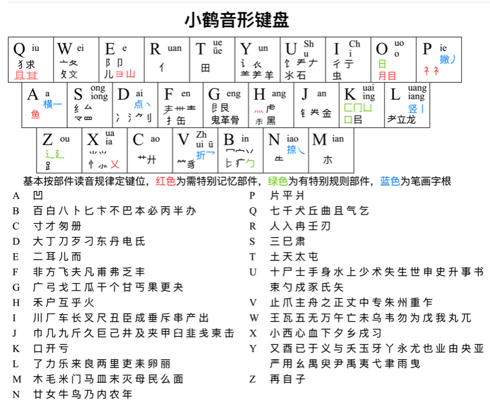

## Rime 输入法双拼加辅助码方案

Rime 输入法配置方案，小鹤双拼+小鹤形码辅助方案。使用后打字几乎不需要翻页，且学习成本明显低于五笔等输入方案。
如果用户还不了解双拼输入方案，或者不熟悉 Rime 输入法软件，可以先查看 [双拼与 Rime 输入法入门](intro.md)
当然，您也可以先往下翻，看看本项目能提供什么样的功能。

### 特性说明

- 自创音码飞键规则，替换一些手指 _移动不和谐_ (别手)的小鹤音码组合, 实现左右手对侧击键, 更有节奏感
- 支持一键展开超级简拼, 开启简拼功能时按下 `Ctrl+0` 会展开成简拼, 显示短语候选项
- 加入了长词优选功能, 常见成语短句排在第一页, 短单词(字母少于4个)不会置顶和补全
- 支持多种常见格式的英文单词输入, 如：`Tool`, `TOOL`, `tool`, 非英文单词(wechat)也可有多格式输出
- 支持中英文输入方案中英混合输入自动添加空格, 特定英文符号 (,.!?:) 后面也会添加空格
- 支持英文单词「自造词」, 在单词末尾输入 `\` 符号, 下次(重新部署后)即可直接输入生词
- 支持强制删词, 按下 `Ctrl+d` / `Ctrl+x` 触发将高亮词条彻底隐藏或置于末位, 立即生效
- 支持词条降频, 按下 `Ctrl+j` 触发将高亮词条置于第4位(默认, 可配置), 立即生效
- 支持词条置顶, 按下 `Ctrl+t` 触发一键置顶功能, 先置顶的词条优先级最高, 后置顶的次之, 立即见效
- 支持注解切换, 按下 `Ctrl+n` 触发注解轮切功能, 可显示带调拼音、鹤形码、无注解, 立即见效
- 支持注解上屏, 按下 `Ctrl+p` 可上屏带调拼音、鹤形码
- 支持中英切换, 按下 `Ctrl+g` 可从中文输入方案一键切换到英文输入方案
- 支持单字模式, 按下 `Ctrl+s`  即可切换到全局生效的四码(音形码)匹配单字优先
- 支持中英互译, 按下 `Ctrl+y` 可将高亮候选项一键发送到 `Easydict` 翻译(仅支持 macOS)
- 支持斜杠 `/` 过滤单字和词组(匹配单字的音形四码), 比如输入 `uu/i` 自动上屏「输」
- 支持斜杠 `/` 过滤二字词组(匹配末首两位形码), 比如输入 `uiui/oz` 自动上屏「适时」
- 支持分号 `;` 前缀快捷输出符号, 比如输入 `;d` 自动上屏 `、` , `;j` 上屏 `#`  可自行配置
- 支持 Emoji 表情智能显示, 首页表情降频到第6位; 支持微信内专属应用表情显示(其他应用隐藏)
- 支持 MacOS 符号成对输出且光标居于符号内部, 如: `()`, `【】`, `''`等
- 支持 MacOS 下输入 `/jk` 前缀的自定义短语, 触发启动或切换 App 应用; 输入 `/kj` 可见快捷操作菜单

### 音码飞键组合说明

- 原理类似 Rime 模糊音, 只是采用的是 **不对应汉字读音的字母组合** , 或者某些字母组合的汉字是低频字, 会被挪用
  替换的字母组合 和 被替换的字母组合 不会相互影响 正常输入, 如若不喜欢或感觉不适可自行删除调整, 默认禁用
  替换的字母有这些 `e-->q`，`f-->q` ，`t-->d` , `y-->w`, `s-->b`
- ```yaml
  - derive/^(j)n/$1c/
  - derive/^([jyn])t/$1d/   # t --> d
  - derive/^([bjlmn])p/$1e/ # p --> e
  - derive/^([djlnx])q/$1f/ # q --> f
  - derive/^q([biklmnpsxy])/f$1/
  - derive/^qt/fd/
  - derive/^qu/fe/
  - derive/^qr/fo/
  - ...
  ```

### 方案说明

- 方案名称为“飞鹤快拼”，它提供了小鹤双拼+形码辅助选字的输入方案，默认 **开启** 直接辅码。
  如果希望使用 直接辅码(无引导符)，可以在 `flypy_xhfast.custom.yaml` 文件里取消注释。
- 允许纯双拼输入。使用形码辅助造词之后，下次可以直接使用双拼音码输出这个词组, 且置顶。
  双形辅助码根据简体字字形给出，即使在繁体输入模式下也是如此。
- 
- 默认为单字（除了手动置顶的那些）显示其小鹤辅助码。可以在 配置文件里设置「关闭单字编码提示」。
- 在 [这个页面](https://xh.flypy.com/#/xyx) 的尾部可以看到小鹤的双形拆分规则。另外，本项目只提供单字形码，
  对词组形码有需求的用户可以用下文中提到的转换脚本来生成带形码的词库。

### 文件说明

- 将这些文件放入 Rime 的用户目录下，重新部署（右键点击任务栏的 Rime 图标可见）即可。
  - librime 允许输入法指定用户文件夹的位置。用户文件夹的位置应使用绝对路径。请勿使用相对路径
  - 默认的用户目录:
  - `%APPDATA%\Rime` (Windows，小狼毫: 可以通过「开始菜单＼小狼毫输入法＼用户文件夹」打开)
  - `~/Library/Rime` (MacOS，鼠鬚管: 可以通过「系统输入法菜单／鼠鬚管／用户设定…」打开)
  - ibus-rime: `~/.config/ibus/rime`
    fcitx-rime: `~/.config/fcitx/rime`
    fcitx5-rime: `~/.local/share/fcitx5/rime/`
  - `/sdcard/rime` (Android)
  - 如果 Rime 老用户之前已有较多配置文件，希望在不混淆各类配置的同时试用本项目的完整功能。
    可以考虑备份、重命名原来的用户目录，将本项目单独放在新建的用户目录下部署。
- 一些设置项需要通过修改文件内容实现。推荐使用 VS Code，Sublime Text 等通用代码编辑器。
  - 没有也不想安装代码编辑器的用户可以考虑使用 [在线 YAML 编辑器](https://codebeautify.org/yaml-editor-online)。
  - 所有配置文件都应以 UTF-8 编码保存，YAML 文件还需要保持严格的缩进 (只能用空格)。
- `flypy_xhfast.schema.yaml` 和 `flypy_xhfast.dict.yaml` 为本方案的主要文件。
  `flypy_xhfast.custom.yaml` 提供了一些常用设置项。其余文件均用于附加功能。
- `default.custom.yaml` 仅用于声明本方案的依赖方案。如果用户已经有同名的文件，并且其中设置
  了 `schema_list` 选项，可以直接将本项目同名文件的内容添加到该选项下，而不必使用项目提供的这一文件。
- `cn_dicts/*.dict.yaml`, 为中文词库词典文件。
- `en_dicts/*.dict.yaml`, 为英文词库词典文件。
- `rime.lua` 文件用于涉及 Lua 的相关功能。
- `scripts/flypy_dict_generator.py` 双拼词库转换程序，实现了汉字转小鹤双拼，小鹤音形码，简拼, 支持
  输出到 `yaml` 字典和 `txt` 自定义短语文件，可指定词库内容追加输出，可指定初始词频，或默认源词库的词频。
- 方案自带 emoji 输出，提供了 `emoji_word.txt` 文件, 通过 OpenCC 来转换得来。
- `easy_en.schema.yaml` 和 `easy_en.dict.yaml` 为作者基于 [easy-en](https://github.com/BlindingDark/rime-easy-en) 项目的英文输入方案修改得到的版本。

### 前缀模式

- `/` 前缀：符号模式，具体见本方案的 [`symbols.custom.yaml`](https://github.com/boomker/rime-fast-xhup/blob/main/symbols.custom.yaml) 文件。例如：敲 `/jt` 按 3，即可输入箭头“←”。
- `/oh` 前缀：本方案帮助菜单, 输入 `/help` 效果等同, 可查看方案中的快捷键, 功能触发前缀字符串等。
- `/ok` 前缀：小鹤双拼键位查询，该功能为双拼初学者提供。如: 敲 `okian`，可看到对应的按键是 `m`。
- `/oe` 前缀：单词模式，允许「简写」、「略写」，可省略掉除了首字母以外的所有元音字母(`aeiou`)。
  * Tips：
    - 单词第一次输入时用简写，Rime 记录它的词频进用户词典, 之后的输入就会排在靠前的位置。
    - 单词中输入 `*` 可以模糊匹配，比如：敲 `bea*l` 就可以看到 `beautiful` 这个单词。
- `/jk` 前缀: 用于快速启动或切换程序, 目前只在 macOS 上测试过。
- `/kj` 前缀: 用于输入常用短语(邮箱/手机号/银行卡号/收件地址); 和打开常用网站网址, 本地文件路径;
  执行常见指令(开关系统设置) 等等, 可自行在 [配置文件](https://github.com/boomker/rime-fast-xhup/blob/main/lua/launcher_config.lua) 里添加。
- `/hs` 前缀: 历史上屏记录, 充当简易输入记录器, 聊天记录回溯😈, 不会记录 Emoji 表情。
- `/so` 前缀: 方案选项切换功能菜单, 实现了方案中个性化配置与选项热切换或更改(免部署生效)。
- `/cn` 前缀: 用于输入中文数字, 例如: 输入 `/cn` `123` 得到 “一百二十三”, “壹佰贰拾叁”, 等。
- `/lt` 前缀: 简易 LaTeX 公式。例如：敲 `/lt` `ff>>ooc` 空格，即可输出 `$\phi\rangle\propto$`。
- `/wf` 前缀: 微信表情列表; `/mba` `/mbs` `/mbc` 前缀: Markdown 代码块快捷输入。
- `date`, `time`, `today`, `week`, `/wd`, /`wt`, `/wk`, `/nl`, `/uts` 可以输出当天的日期时间, 星期, 农历等。
  `/wqt` `/wzt` `/wmt` `/wht` `/wuz` `/wxz` `/wuy` `/wxy` 等可输出最近(昨天, 上周, 上个月等)的日期时间。
- `/=` 前缀: 计算器, 支持加减乘除法, 开方、幂次方、阶乘、正弦余弦函数等多种运算。
- `~` 前缀：部件组字模式 (类似搜狗拼音的 u 拆字模式)，其中部件按照小鹤双拼输入。
  例如，要输入「犇」字 (拆为「牛牛牛」)，敲 `~nqnqnq` 空格即可，并看到这个字的拼音是 `ben`。
- `@` 前缀: 显示常用邮箱后缀域名, 用于快捷输入。可自行添加自己公司邮箱域名后缀。
- `;` 前缀: 用于自动上屏一些标点符号, 具体编码在 [`symbols.custom.yaml`](https://github.com/boomker/rime-fast-xhup/blob/main/symbols.custom.yaml) 里, 可自行修改。
- `;f` 前缀: 表情模式, 用于输出常用 emoji 表情和微信表情。比如: 输入 `;fdv` 会输出✅。
- `V`  前缀：表情模式, 用于输出 emoji 表情。比如, 输入 `Vuvgo`, 会输出「水果」🍎类表情。

### 额外的键位

- 对 Rime 默认 Emacs 键位的一些补充:

  - `Control+m` 可以替代回车。例如，敲 `yyds` 之后按这个键，输入的就是"yyds"。
  - `Control+w` 可以替代 `Control+退格`，为删一个字的码。例如，敲 `buk` 或者 `buke[dk` 之后，
    按这个键得到的都是 `bu`，可以继续敲后面的字。如果在词组输入时发现敲错了，可以用这个方式删掉最后的字。

  > Rime 自带的 Emacs 键位包括 `Control+[` 替代 `Esc`，取消当前输入；以及 `Control+h` 替代退格。另外，
  > 作者喜欢用 `Control` 键是因为在系统里配置了大写锁定和左 `Control` 交换，这样按起来很舒服。由于这是系统的
  > 配置而不是 Rime 的，本文件中没有说明其设置方式。
  >

  - 词组的双拼部分输入完成后，可用 `` ` `` 键逐字追加辅助码。例如，想输入「林纳斯」，
    可以敲 ``lb`m na`sn si`q``，这与直接敲 `lb[m na[sn si[q` 是等价的。
  - 这也能用于重码太多的词库已有词。例如，希望输入「适时 」一词，敲 `uiui` 发现候选太多，补上最后一个字的形码
    后 `uiui[oc` 还是没在第一页看到它。此时按 `Tab[`，输入框成为 `ui[ 光标 ui[oc`。补充敲下第一个字的形码部分 `z`，
    然后按 `Control+e` (或者 `End`) 把光标移动到最后，即可看到想要的「适时 」一词出现在候选中。

### 关于各 Rime 发行版支持

- [librime 项目](https://github.com/rime/librime/releases) 建议手动安装或自行编译
- 小狼毫(Windows)和鼠须管(MacOS)的最新版本
- 小企鹅(Fcitx5-macos) 要在 [GitHub 页面](https://github.com/fcitx-contrib/fcitx5-macos) 下载最新版, 支持卷轴模式
- 小企鹅(Fcitx5-android)要在 [GitHub 页面](https://github.com/fcitx5-android/fcitx5-android) 下载最新CI版, 支持长按删词
- 中州韵(Linux) 据说 Arch 源提供了 fcitx5-rime , 作者没使用过, 请自行测试
- Trime(Android)要在 [GitHub 页面](https://github.com/osfans/trime) 下载最新测试版, 作者没使用过, 请自行测试

### 给进阶用户

这一 Rime 输入方案的制作主要利用了这些文档，希望对 Rime 进行更深入的个性化配置的用户可以参考：

- [GitHub-UserGuide](https://github.com/rime/home/wiki/UserGuide)
- [Gitee 版 UserGuide](https://gitee.com/lotem/rime-home/wikis/UserGuide)
- [设定项详解](https://github.com/LEOYoon-Tsaw/Rime_collections/blob/master/Rime_description.md)

### FAQ

1. - Q: Windows 系统部署项目失败, 一直处于部署中
   - A: 注释 **[flypy_xhfast.dict.yaml](https://github.com/boomker/rime-fast-xhup/blob/main/flypy_xhfast.dict.yaml)** 文件里大词库
2. - Q: 分号 `;` 为什么不能直接上屏, 不想使用 `;` 引导的标点符号输出方式
   - A: 在 `custom` 配置文件里解开 [这行](https://github.com/boomker/rime-fast-xhup/blob/main/flypy_xhfast.custom.yaml#L105) 注释, 并将下一行注释掉. 或者在 `/so` 里进行切换
3. - Q: 如何取消中英混合候选词条中的空格?
   - A: 注释 `custom` 配置文件里的 [这行](https://github.com/boomker/rime-fast-xhup/blob/main/flypy_xhfast.custom.yaml#L45)
4. - Q: 中英混合输出自动添加空格功能, 有时会在编辑区起始位置添加空格
   - A: 这个功能目前还不够完善, 可以将 [这行](https://github.com/boomker/rime-fast-xhup/blob/main/flypy_xhfast.custom.yaml#L46) 注释掉
5. - Q: 形码辅助引导符可以去掉吗? 想直接使用辅助码, 不用引导符(`[`)
   - A: 默认直接辅助, 可以的, 解开 [这行](https://github.com/boomker/rime-fast-xhup/blob/main/flypy_xhfast.custom.yaml#L118) 注释即可. 若想还原引导符辅助, 加上注释即可
6. - Q: 快捷指令功能能在移动端支持触控点击吗?
   - A: 目前暂不支持
7. - Q: 符号配对功能在 Windows 下无法使用?
   - A: 作者没有 Windows 系统，所以无法测试。
8. - Q: 在微信聊天里, 有一些候选项带有中括号 `[]` 是怎么回事?
   - A: 这是微信表情, 在候选菜单里不能显示, 在微信里可正常显示. 是通过 [`OpenCC`](https://github.com/BYVoid/OpenCC) 在 [`emoji_word.txt`](https://github.com/boomker/rime-fast-xhup/blob/main/opencc/emoji_word.txt) 编码的
9. - Q: 音码飞键规则是什么, 可以删除或不启用吗?
   - A: 不对应汉字读音的字母组合来编码一些小鹤双拼的音码, 这些规则默认不启用 可以删除(不推荐)
10. - Q: 词库中存在注音错误的词条
    - A: 因为采用开源的 [`pypinyin`](https://github.com/mozillazg/python-pinyin) 项目，存在词组中多音字返回了另外一个注音
11. - Q: 有一些字打不出来, 字表中的字不全或形码错误
    - A: 生僻字可以通过上述的 `~` 反查功能来输入, 还可以启用 [扩展字表](https://github.com/boomker/rime-fast-xhup/blob/main/flypy_xhfast.dict.yaml#L10) ; 形码错误或可能是容错码, 可自行修改
12. - Q: 候选菜单里有无法显示的像「问号」一样的候选字
    - A: 在 [`squirrel.custom.yaml`](https://github.com/boomker/rime-fast-xhup/blob/main/squirrel.custom.yaml) 或 [`weasel.yaml`](https://github.com/boomker/rime-fast-xhup/blob/main/weasel.yaml) 配置可以正常显示的字体, 推荐 [`MiSans`](https://hyperos.mi.com/font/download)
13. - Q: `~` 反查出来在字没有注音, 部署日志中提示缺少 `kMandarin` 反查词典文件
    - A: 请自行到这个[项目](https://github.com/mirtlecn/rime-radical-pinyin/releases)下载反查注音文件, 或将 `others` 下的 `kMandarin.reverse.bin` 移动到 `build` 目录里
14. - Q: 自定义修改候选项数量、候选菜单方向、外观主题等配置应该从何着手？
    - A: 多个方案统一全局配置修改候选项数量、候选菜单方向, 应该修改[default.custom.yaml文件](./default.custom.yaml). 外观主题、字体大小等样式则是修改[weasel.custom.yaml](./weasel.custom.yaml) (Windows小狼毫) [squirrel.custom.yaml](./squirrel.custom.yaml)(苹果鼠须管). 单独为某个方案修改, 应该修改具体的方案文件 `***.schema.yaml` 所对应的补丁文件 `***.custom.yaml`. 如: `飞鹤快拼`的方案文件是 [flypy_xhfast.schema.yaml](./flypy_xhfast.schema.yaml), 对应的补丁文件是 [flypy_xhfast.custom.yaml](./flypy_xhfast.custom.yaml). 此文件具有最高优先级, 会覆盖其他所有文件的配置.
   
### 鸣谢

- [Rime](http://rime.im/), 开源输入法框架, 本项目方案来源于它
- [自然快手](https://github.com/functoreality/rime-flypy-zrmfast), 本项目方案最开始受到此项目启发
- [雾凇拼音](https://github.com/iDvel/rime-ice), 本项目方案词库由此项目转换而来
- [汉字部件拆字](https://github.com/mirtlecn/rime-radical-pinyin), 汉字反查方案功能来源于它
- 热心网友, 其他开源输入法方案
